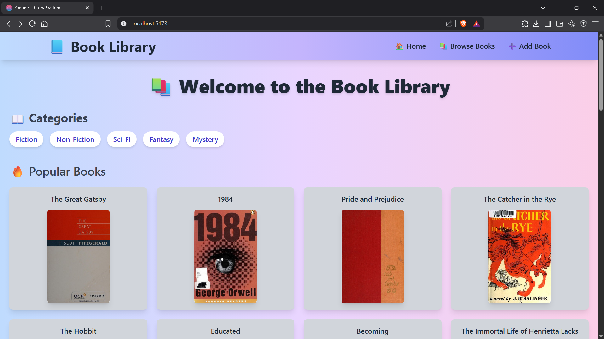

# 📚 Online Library System

The Online Library System is a web application built with **React**, **Redux**, **React Router**, and **Vite**. The system allows users to browse books, view detailed information, add books, and search for books by categories. This project was created to provide a simple and efficient way to manage and view library books.

## 📦 Features

- **Browse Books** – Displays a list of books with details fetched from a local dummy data file.
- **Book Details Page** – Detailed view of a selected book using route parameters.
- **Add a Book** – Form to add new books to the library.
- **Search Functionality** – Search books by title and category.
- **Routing** – Implemented using `react-router-dom`.
- **Responsive UI** – Works well on all screen sizes.
- **Error Handling** – Handles errors gracefully with fallback UI.

## 🧱 Tech Stack

- **React 19**
- **Redux Toolkit**
- **React Router v7**
- **Vite** (for fast bundling)
- **TailwindCSS** (for styling)
- **ESLint** (code linting)
- **UUID** (for unique IDs)

## 📁 Folder Structure

```plane text
src/
│
├── components/
│ ├── Navbar/
│ │ └── Navbar.jsx
│ ├── BookCard/
│ │ └── BookCard.jsx
│ ├── CategoryList/
│ │ └── CategoryList.jsx
│ ├── SearchBar/
│ │ └── SearchBar.jsx
│ ├── Footer/
│ │ └── Footer.jsx
│
├── pages/
│ ├── Home.jsx
│ ├── BrowseBooks.jsx
│ ├── BookDetails.jsx
│ ├── AddBook.jsx
│ └── NotFound.jsx
│
├── redux/
│ ├── store.js
│ └── booksSlice.js
│
├── data/
│ └── dummyBooks.js
│
├── App.jsx
└── index.jsx
```

## 🎨 Demo

- 
- 
- 

## 🚀 Installation

Follow these steps to set up and run the project locally.

### 1. Clone the Repository

```bash
git clone https://github.com/ankitNegiDev/LibrarySystem

cd online-library-system
```

### 2. Install Dependencies

```bash
npm install

```

### 3. 3. Run Development Server

```bash
npm run dev

```

## 📝 License

This project is created for educational purposes and is intended for learning and demonstration of React-based applications.
